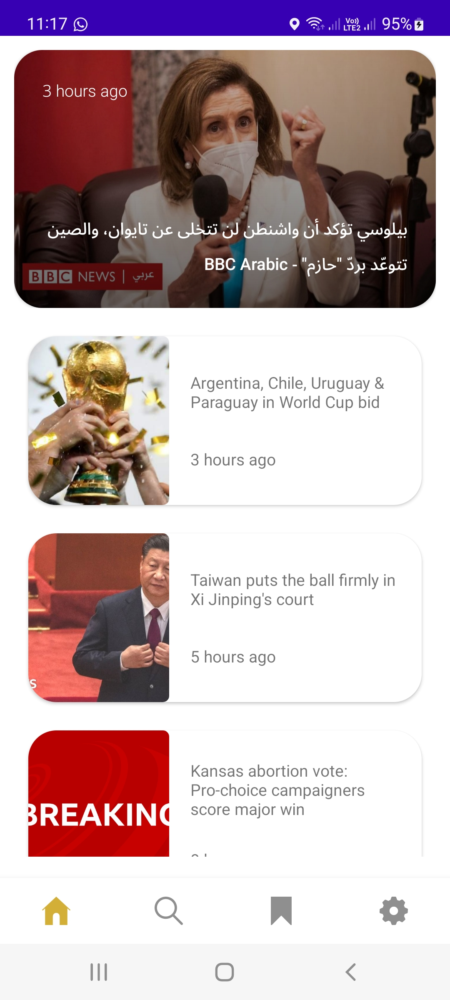
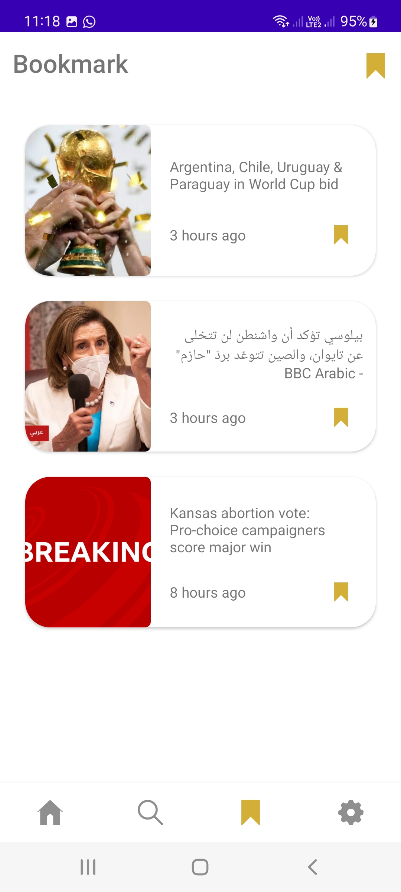

# News!
News app is designed to helps people to read last news.

## Requirements
*   Home screen that include top banner for egypt news, latest news from BBC and the next Web
*   Search Screen for search on any news from the API.
*   Details Screen 
*  Bookmark 

 ###### **Tecgnologes uses in it.**
 * Kotlin.
 * MVVM Design Pattern
 * Hilt
 * Room Database
 * live Data
 * Coroutines
 * Retrofit
 * okhttp3
 * navigation component
 * mockwebserver for testing
 * truth for testing
 
 *  **[Api for simple json] (https://newsapi.org)**.

  ###### **Tools and IDEs uses.**
* Android Studio

*   **[Download latest debug APK here] (https://github.com/azmiradi/News/blob/master/app-debug.apk)**.
 
 
| Home | Details | Bookmark | Search |
| --------------- | ---------------- | 
|  |  |  |  |

<!--Galaxy A 72-->
